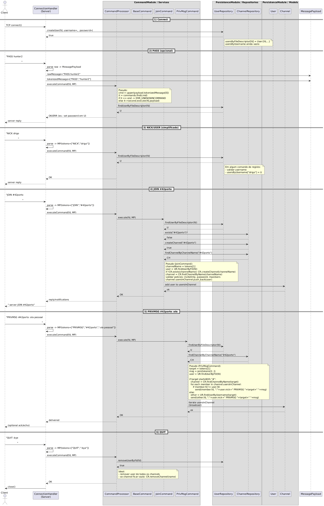
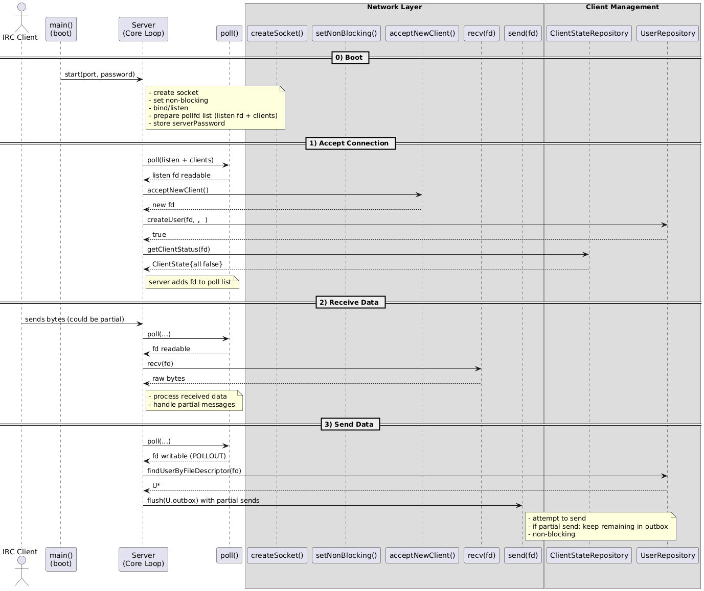
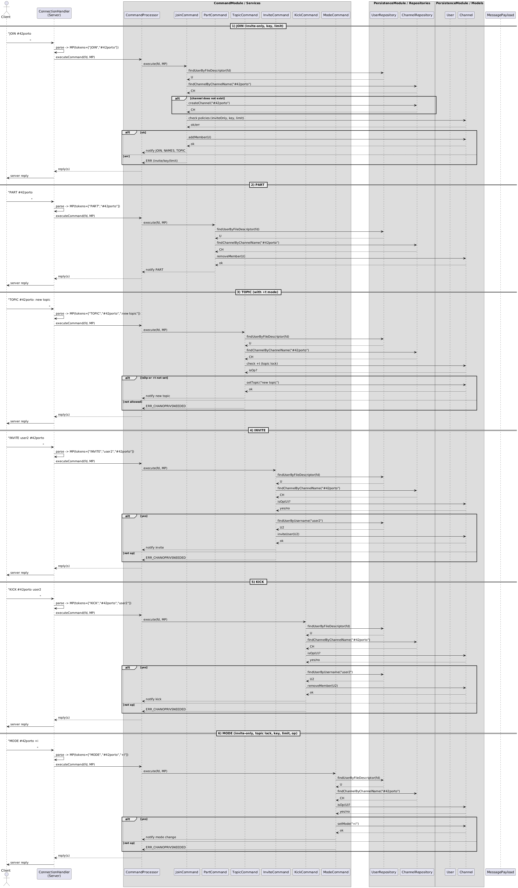

*This project has been created as part of the 42 curriculum by rerodrig, cde-paiv, rde-fari.*

## Description
This project implements a minimal IRC (Internet Relay Chat) server in C++. The goal is to handle multiple clients concurrently, parse and dispatch IRC commands, and manage channels, users, and server replies according to the IRC protocol.

## Instructions
### Requirements
- A C++ compiler with C++98 support
- make

### Build
```sh
make
```

### Run
```sh
./ircserv <port> <password>
```

### Example
```sh
./ircserv 6667 mypassword
```

### Diagrams
Base execution flow:


Networking:


Command handling:



## Resources
- RFC 1459: Internet Relay Chat Protocol
- RFC 2812: Internet Relay Chat: Client Protocol
- RFC 2813: Internet Relay Chat: Server Protocol
- https://modern.ircdocs.horse/
- https://hexchat.readthedocs.io/en/latest/
